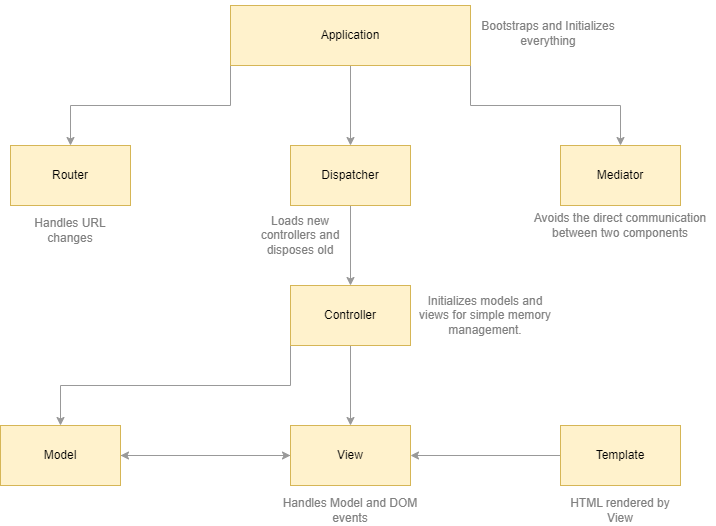

# Fraims MVC framework

This framework has not been designed to be used in a professional environment. It is only to be used as a learning resource.

## Dependencies

Primary dependencies are [handlebars](https://www.npmjs.com/package/handlebars) for template hydration implementation, [pubsub-js](https://www.npmjs.com/package/pubsub-js) for the EventEmitter implementation

## Architecture

## Framework Components

1. **Application**
This is the root component of the framework. The application component is in charge of the  initialization of all the internal components of the framework (mediator, router, and dispatcher).
2. **Mediator**
The mediator is in charge of the communication between all the other components in the application.
3. **Application Events**
Application events are used to send information from one component to another. An application event is identified by an identifier known as a topic. The components can publish application events as well as subscribe and unsubscribe to application events.
4. **Router**
The router observes the changes in the browser URL and creates instances of the Route class that are then sent to the Dispatcher using an application event.
5. **Routes**
 These are used to represent a URL. The URLs use naming conventions that can be used to identify which controller and action should be invoked.
6. **Dispatcher**
The dispatcher receives instances of the Route class, which are used to identify the required controller. The dispatcher can then dispose the previous controller and create a new controller instance if necessary. Once the controller has been initialized, the dispatcher passes the execution flow to the controller using an application event.
7. **Controllers**
 Controllers are used to initialize views and models. Once the views and models are initialized, the controller passes the execution flow to one or more models using an application event.
8. **Models**
 Models are in charge of the interaction with the HTTP API as well as data manipulation in memory. This involves data formatting as well as operations such as the addition or deletion of data. Once the Model has finished manipulating the data, it is passed to one or more views using an application event.
9. **Views**
  Views are in charge of the load and compilation of templates. Once the template has been loaded, the views wait for data to be sent by the models. When the data is received, it is combined with the templates to generate HTML code, which is appended to the DOM. Views are also in charge of the binding and unbinding of UI events (click, focus, and so on).
